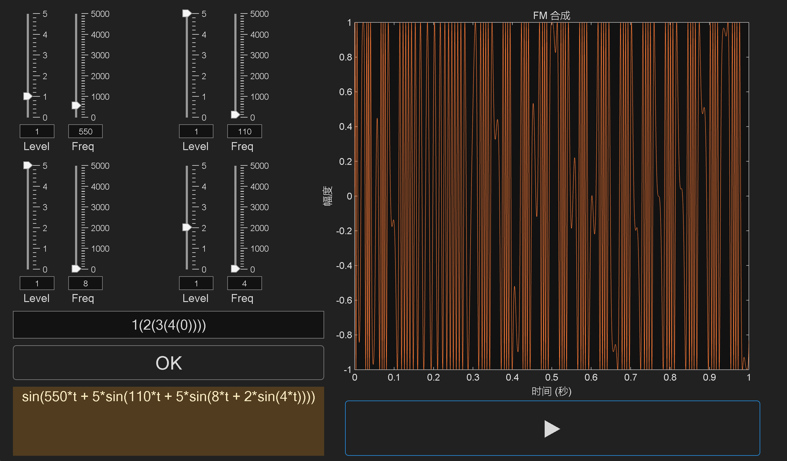
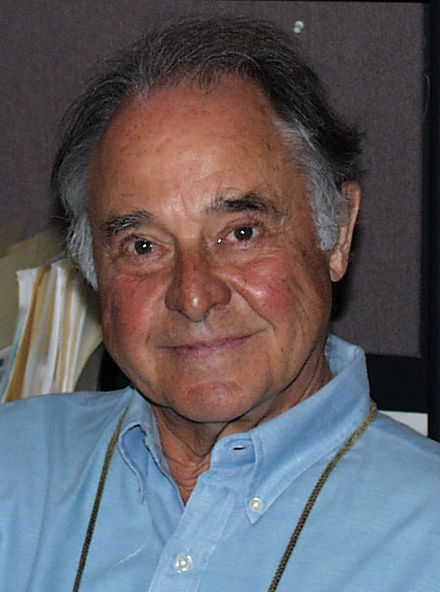
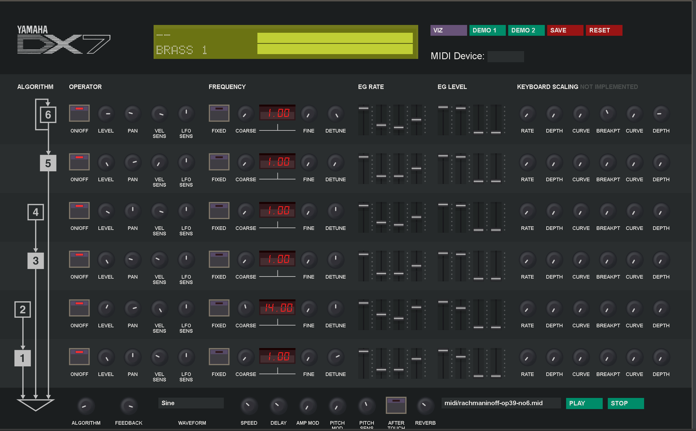
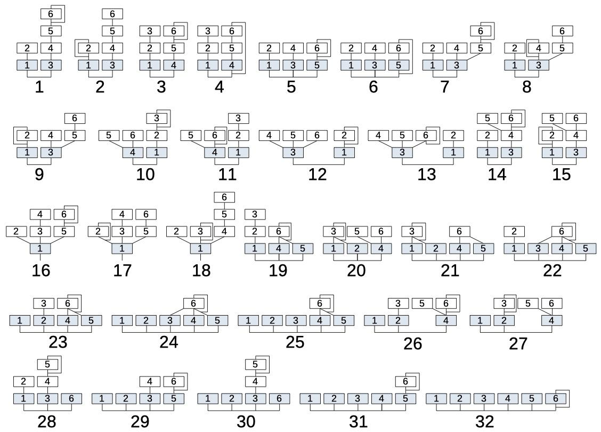

# MATLAB - FMSynthesizer
一个基于FM合成原理通过 MATLAB 实现的 声音合成器 (默认4个振荡器)

## 目的
1. 熟悉FM合成基本原理
2. 实现振荡器与调制器的任意算法组合(DX 7/9 分别只有 32/8 种算法可选，且不能控制振荡器与调制器总数)

## introduction
### FM原理
FM源于广播，因为天线长度有限，不能直接发送或接收低频信号。为了解决这个问题，FM技术通过改变高频信号的频率来反映低频信号的强弱变化，这样我们就能用天线接收到这些“转化”后的信号了。简单来说，FM就是把声音的高低起伏变成无线电波的频率变化，让我们能通过收音机听到广播节目。

而其中低频波段称为调制波，接受调制波调制的则为载波。

将以上文字转化为公式即为(假设都为正弦波)
y = A sin(wt + A' sin(w't))

而FM合成器的基本原理就是如此

而关于FM如何调制出无穷的音色可阅读chowing的论文中负频率和贝叶斯函数的介绍

The Synthesis of Complex Audio Spectra by Meansof Frequency Modulation by JOHN M. CHOWNING

值得一提的是chowing在1967年发明了这项技术，其本人还是一名作曲家

### YAMAHA的创新
chowing于1973年将这项技术授权给了yamaha

在1983年yamaha 推出了DX 7

https://mmontag.github.io/dx7-synth-js/  (yamahadx7的网页版复刻)

除了应用过去的ADSR包络以及chowing的FM合成技术，yamaha还提供了对于振荡器于调制器排列组合的32种算法，创造了更加丰富的声音

## 代码分析
### FM_synthesizer
1. 设定了振荡器的基本属性Level Frequency
2. 设定了generatewave函数用于生成符号表达式
### FMSynthesizerGUI
1. 绘制了基本的软件界面
2. 编写了文字转化为算法表达式的函数change，基本思路是通过递归来进行转化。结合generatewave函数可实现任意的算法设计

举例1(2(3(3(0))))+4(0)可表示下图算法
)))+4(0).png)

3. 编写了generateWaveformData函数，将change函数生成的表达式转化为具体的音频信号
4. 编写了各个按钮与输入框的回调函数

### 可调参数
1. 采样率Fs,受限于代码性能初始状态为16000次/s
2. 音源播放时长(仔细观察代码会发现generateWaveformData函数实际可接受一个完整的信号周期，但由于性能限制，此处设定为1s)，以及暂停时间(根据播放时长调整)
3. 振荡器数量,默认4个(如要调整需添加或删除对应振荡器模块的UI，以及类实体，并在playbuttoncallback函数中添加或删除类实体数据更新代码)

## 缺陷
1. 代码运行效率过低
2. 缺少ADSR包络以及MIDI信号输入
3. 振荡器目前只能输出正弦波
## 运行
将文件下载到本地，在MATLAB中打开两个m文件，将两个文件添加到执行路径，运行FMSynthesizerGUI.m文件

## 参考
1. The Synthesis of Complex Audio Spectra by Meansof Frequency Modulation by JOHN M. CHOWNING
2. FMTheory& Applications By Musicians for Musicians by Dr.John Chowning and David Bristow
3. https://yamahadx9.com/index.html
4. https://mmontag.github.io/dx7-synth-js/

